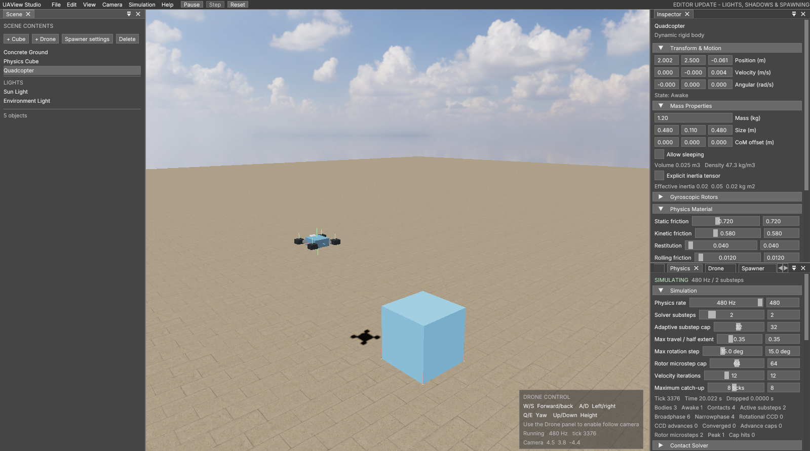
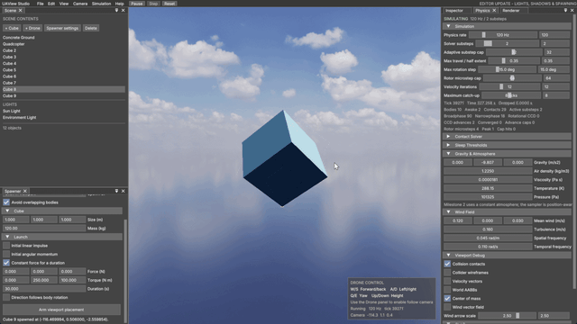
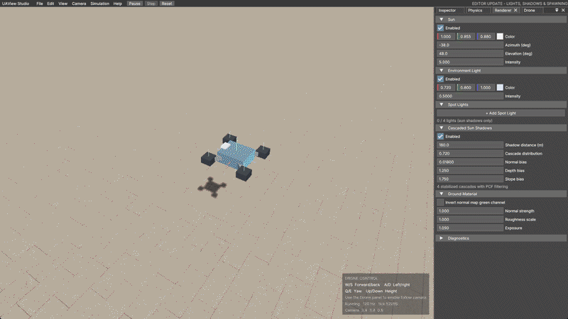

<div align="center">


# UAView Studio

A physics simulator and Vulkan editor for drone development.



</div>

A physics simulator and Vulkan editor I'm building for drone development. The
goal is to have something I can eventually put between my real flight
controller and a simulated world, send it motor commands, and get believable
sensor data back without needing to risk an actual drone every time I change
the firmware.

I originally started this for the **Handshake x Codex Challenge** and didn't
finish it in time. Unlike my flight-controller project, this repository is
mostly AI-generated. I've been deciding what it should do, testing it, breaking
it in increasingly strange ways, and pushing it toward the kind of simulator I
actually need. It has gone quite a bit further than the challenge entry was
supposed to, and right now it's the main contender for the simulator I'll use
on my hardware-in-the-loop bench.

<div align="center">
  
</div>

## Where it's at

The editor can spawn cubes and drones into a physical scene, change their
properties while it is running, throw them around, and show what the collision
solver and environment are doing. The physics runs at a fixed 120 Hz by
default, separately from rendering, and the update rate and solver settings are
exposed in the editor.

The part I've been most impressed by is the rotational physics. Fast-spinning
bodies really do stabilize themselves because angular momentum is part of the
solver. The drone propellers use that same rotor system, so their inertia,
spin-up torque, counter-torque on the frame, and gyroscopic effects exist in
the physics. There aren't hidden reaction wheels or a fake stabilization force
making it behave.

The drone is still a fairly early model, but it flies. It has four physical
thrust points, motor spool time, reaction torque, a mixer, editable cascaded PID
loops, wind response, optional motor variation, and a follow camera. There is
also a direct-mixer mode and an external actuator mode so the internal
controller can be bypassed later by the real flight controller.

**Working**

- Native Vulkan 1.3 editor with Dear ImGui docking
- PBR concrete ground, HDR sky, cascaded sun shadows, and editor lights
- Headless C++17 physics core with no Vulkan, windowing, or UI dependency
- Velocity Verlet integration with a configurable fixed update rate
- Full inertia tensors and conserved world angular momentum
- Static and dynamic friction, restitution, rolling resistance, and sleeping
- Oriented-box collision detection and multipoint contact manifolds
- Translational anti-tunneling and conservative rotational CCD against planes
- Projected-area drag, angular drag, constant atmosphere, and a 3D wind field
- Physical spinning rotors with gyroscopic precession and chassis counter-torque
- X-quad motor mixer and adjustable cascaded PID controller
- Ideal gyro, accelerometer, pressure, temperature, and altitude outputs
- Primitive and drone spawning, deletion, live property editing, and debug views
- Ctrl + LMB spring pulling for physically dragging objects

**In progress / not connected yet**

- The sensor and actuator structs are exposed, but there is no UDP or UART
  transport yet
- Sensor output is still ideal and runs at the physics rate, not an independent
  1 kHz IMU rate
- LiDAR has a reserved API channel but no simulation behind it
- The drone is still using a conservative box collider instead of its real shape

## Gyroscopic effect

This is one of the reasons I kept the rotational model in the physics core
instead of faking the effect for the editor. A cube with enough angular
momentum naturally fights changes to its spin axis, precesses under torque, and
eventually loses energy through the configured drag and contacts.

<div align="center">
  
</div>

## Drone interaction

Multiple drones can exist in the same world and go through the same contact and
force pipeline as every other rigid body. The collider is still coarse, so this
isn't a propeller-strike or damage model yet, but they can physically collide
instead of passing through each other.

<div align="center">
  
</div>

## Some numbers

I wanted a few baselines in here so improvements don't turn into "it feels
better" with nothing behind them. These were measured from the Windows Release
build on **July 18, 2026**. The timing numbers are obviously specific to this
machine and these test scenes.

| Metric | Result |
| --- | ---: |
| Default physics update | 120 Hz |
| Editor update-rate range | 30-480 Hz |
| Default solver substeps | 2 |
| Maximum solver substeps | 16 |
| Release tests | 7/7 passing |
| Full Release test run | 0.40 s |
| C++ source/header files, including tests | 24 |
| C++ lines, including tests | 19,322 |
| GLSL shader files | 7 |
| Release editor executable | 1.54 MiB |

The focused hover test starts the drone at a 3 m target and runs it for 10
seconds. It finished at **3.00197 m**, moving vertically at
**-0.000710 m/s**, with its up axis exactly aligned to world up in that run.

The 3.5 m/s crosswind test produced **1.133 m** of drift after seven seconds
and a visible corrective lean from the controller. The corner-impact stress
test recorded **206 rotational CCD hits**, no rotation-cap hits, and a maximum
measured physics step of **0.1205 ms**. A separate 10 mm plate-settling case
stayed finite and topped out at **0.0199 ms** per measured step.

Those are regression cases, not proof that every possible scene is physically
accurate. They are mainly there to catch the solver exploding, tunneling, going
non-finite, or quietly changing behavior while I work on it.

## What I want to add

### Better body aerodynamics

Body aerodynamics are still a speed-squared drag calculation in
`World::accumulateForces`, using the projected area of the body's box. That is
enough for wind to matter, but it isn't a proper fuselage model.

I want to calculate the local air velocity in the drone's body frame and use
angle of attack and sideslip:

$$
\alpha = \operatorname{atan2}(v_y, v_z)
$$

$$
\beta = \arcsin\left(\frac{v_x}{\lVert v \rVert}\right)
$$

From there I can get lift $C_L$, drag $C_D$, and pitching moment $C_m$ from
fitted polynomials or lookup tables and apply the resulting forces at the
correct center of pressure. That should make a fuselage react differently when
it is flying forward, slipping sideways, or tumbling instead of treating every
direction as another version of box drag.

### Blade Element Theory for the rotors

`Drone::advance` currently treats each propeller as one disk. Thrust and
reaction torque scale with RPM squared, with a basic correction for axial
inflow. It works well enough for the controller and wind tests, but it leaves a
lot out.

The next serious rotor model I want to try is Blade Element Theory. Each blade
would be divided along its radius into $N$ sections. For every section I would
combine the tangential speed $\omega r$, the drone's vertical motion, and the
local wind, calculate the section's angle of attack, look up its $C_L$ and
$C_D$, and integrate the forces and moments over the full blade.

The math itself is pretty manageable. The harder part is getting useful airfoil
polar data and tuning the blade geometry well enough that the result is more
realistic instead of just more complicated.

### Static mesh colliders

I also want proper static mesh collision for the environment. The first version
would keep dynamic objects as simple convex shapes, build a BVH over a static
triangle mesh, and only feed nearby triangles into narrowphase contact
generation. That would let me use real floors, ramps, walls, test fixtures, and
eventually scanned environments without turning every piece of scenery into a
box.

I don't plan to start with fully dynamic triangle-mesh versus triangle-mesh
collision. For this simulator, a good static environment collider plus stable
convex dynamic bodies is much more useful.

### The actual HIL path

The physics API is deliberately separate from the renderer and already exposes
fixed-size actuator and sensor frames. The missing part is making that boundary
act like real hardware:

- Independent sensor scheduling, starting with a 1 kHz IMU
- Gyro and accelerometer noise, bias, random walk, clipping, and quantization
- Barometer delay, noise, and pressure dynamics
- UDP and UART transports with packet framing and CRC
- Clock synchronization, buffering, dropped-packet handling, and failsafes
- LiDAR, magnetometer, GNSS, optical flow, and battery/ESC models later

The physics world itself will probably stay around 120 Hz. The sensor scheduler
can run faster and interpolate between the previous and current physics states,
which is cheaper than running the entire contact solver at IMU speed.

## What it still gets wrong

- Collision shapes are boxes and infinite planes. There are no convex hulls,
  spheres, capsules, general triangle meshes, or articulated joints yet.
- Broadphase is deterministic all-pairs with AABB rejection. That is fine for a
  small HIL scene, not thousands of objects.
- Rotational CCD handles box-plane motion, while arbitrary rotating box-box
  contact still depends on bounded adaptive substeps.
- The drone has one box around its arms. Propeller collisions, flexible frames,
  landing gear, damage, and blade strikes are not modeled.
- The motor model does not include ESC switching, PWM latency, motor electrical
  behavior, battery sag, measured propeller maps, ground effect, prop wash, or
  vortex-ring state.
- Body aerodynamics use projected box area and isotropic angular drag. There is
  no airfoil model, Magnus effect, or aeroelasticity.
- Sensor values are ideal. There is no noise, drift, saturation, latency, or
  independent sample clock yet.
- The HIL data structures exist, but the actual transport, protocol, CRC,
  diagnostics, timing, and failsafe behavior do not.
- The physics core uses single-precision values and currently runs serially.
- The editor is only built and tested on 64-bit Windows right now.

## Controls

| Input | Action |
| --- | --- |
| Hold RMB + move mouse | Look around |
| Hold RMB + W/A/S/D | Move the editor camera |
| Hold RMB + Q/E | Move the editor camera down/up |
| Hold RMB + Shift | Move the editor camera faster |
| W/S | Fly the drone forward/back |
| A/D | Strafe using the inverted A/D mapping |
| Q/E | Yaw using the inverted Q/E mapping |
| Up/Down arrows | Raise/lower the held altitude |
| Hold Ctrl | Highlight nearby selectable vertices |
| Hold Ctrl + LMB and drag | Pull an object with a spring force |
| Space | Pause/resume physics |
| Period | Advance one fixed tick while paused |
| Ctrl+R | Reset the scene |
| Delete | Delete the selected primitive or drone |
| Home | Leave follow mode and reset the camera |

Drone input is ignored while RMB camera movement is active or while a UI field
is taking keyboard input.

## How it's split up

| Part | What's in it |
| --- | --- |
| `include/uaview/physics/` | Public, renderer-independent physics and drone API |
| `src/physics/` | Rigid bodies, contacts, environment, rotors, and drone dynamics |
| `src/render/` | Vulkan renderer, PBR materials, lighting, shadows, and camera |
| `src/app/` | Dear ImGui editor and the physics/render adapter |
| `shaders/` | GLSL compiled to SPIR-V as part of the build |
| `tests/` | Physics, inertia, rotation, gyro, collision, camera, and drone tests |
| `scripts/` | Bootstrap, build, run, and verification helpers |

The important separation is that the physics library does not include Vulkan,
GLFW, ImGui, or desktop operating-system headers. I want to keep it possible to
run the same core on an ARM Cortex-M4/M33 later instead of rewriting the world
model for the HIL bench.

## Build and run

You need Windows 10/11, Visual Studio 2022 with the C++ desktop workload, CMake
3.24 or newer, Git, and a Vulkan 1.3-capable GPU and driver. The initial setup
also needs internet access to fetch the pinned dependencies.

From PowerShell:

```powershell
.\scripts\bootstrap.ps1
.\scripts\build.ps1 -Configuration Debug
.\scripts\verify.ps1 -Configuration Debug
.\scripts\run.ps1 -Configuration Debug
```

For the optimized build:

```powershell
.\scripts\build.ps1 -Configuration Release
.\scripts\verify.ps1 -Configuration Release
.\scripts\run.ps1 -Configuration Release
```

The executable ends up at:

```text
build\bin\<Configuration>\UAView Studio.exe
```

To build just the portable physics library and tests:

```powershell
cmake -S . -B build-headless -DUAVIEW_BUILD_STUDIO=OFF -DUAVIEW_BUILD_TESTS=ON
cmake --build build-headless --config Release
ctest --test-dir build-headless -C Release --output-on-failure
```

Dependencies are pinned through CMake. The bootstrap script puts the verified
LunarG Vulkan SDK under `.tools/` in the repository instead of changing the
system-wide install.

## Assets

The public repository uses Poly Haven's **Concrete Pavement** material and
**Kloofendal 48d Partly Cloudy (Pure Sky)** environment, both released under
CC0. Inter Variable is included under the SIL Open Font License 1.1.
Attribution and source links are collected in
[`THIRD_PARTY_NOTICES.md`](THIRD_PARTY_NOTICES.md).

The original user-supplied Megascans material is intentionally ignored by Git
and is not redistributed as source content.

## License

The original UAView Studio code is available under the
[MIT License](LICENSE). You can use it in personal, research, or commercial
projects, but the copyright and license notice must remain with redistributed
copies or substantial portions of the software.

Copyright (c) 2026 Alexander Bugar.
